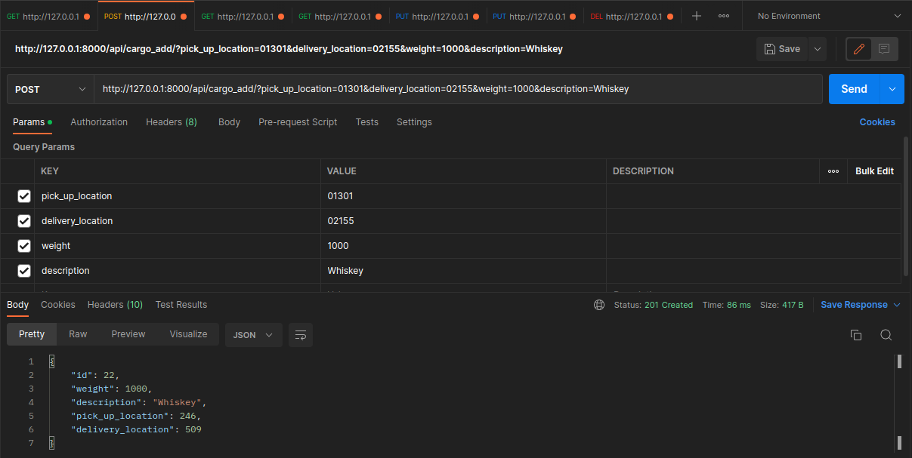
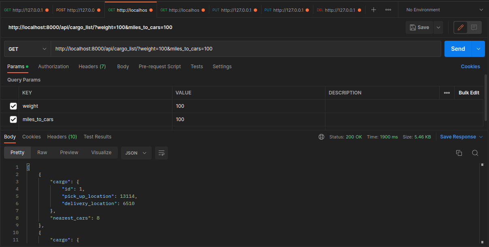
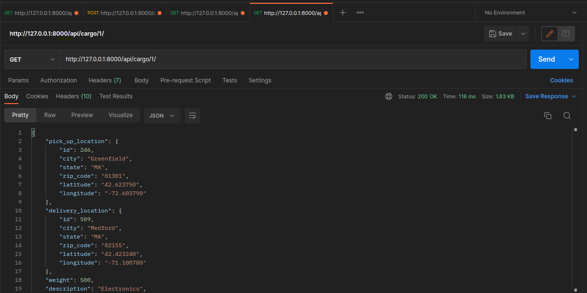
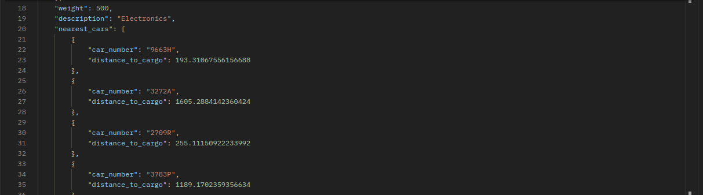
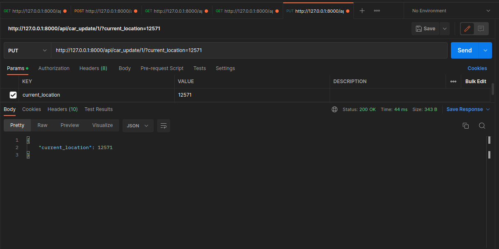
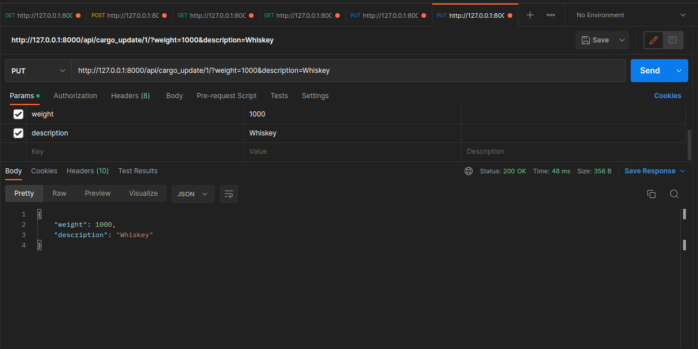
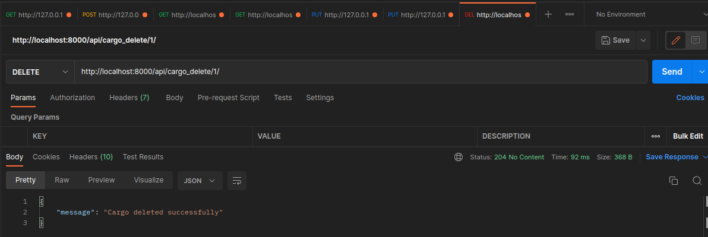

<h1>Cargo API service instruction

<h2>Установка и запуск приложения</h2>
<section><ul>
<li>Клонируйте репозиторий <code>git clonehttps://github.com/CHRNVpy/cargo-api.git</code></li>
<li>Перейдите в директорию репозитория <code>cd Cargo</code></li>
<li>Создайте Docker контейнер <code>docker-compose up</code></li>
</ul>
</section>

<section>
<ul>После сборки контейнера Django сервер запустится автоматически. 
    Создайте миграции
    <li><code>docker exec &lt;название контейнера&gt; python manage.py makemigrations</code></li>
    <li><code>docker exec &lt;название контейнера&gt; python manage.py migrate</code></li>
    <li>Импортируйте данные о локациях 
        <code>docker exec &lt;название контейнера&gt; python manage.py import_locations uszips.csv</code></li>
    <li>Сгенерируйте транспорт 
        <code>docker exec &lt;название контейнера&gt; python manage.py generate cars &lt;количесто машин: int&gt;</code></li>
    <li>Сгенерируйте грузы (не обязательно) 
        <code>docker exec &lt;название контейнера&gt; python manage.py generate cargo &lt;количесто карго: int&gt;</code></li>
    <li>Запустите сервис для автоматического обновления локаций машин каждые 3 минуты (не обязательно) 
        <code>docker exec &lt;название контейнера&gt; cron</code></li>
</ul>
</section>

<h2>API ENDPOINTS</h2>

BASE URL: <code>https://localhost:8000</code>

<section>
  <h3>Добавление груза</h3>
  
<strong>ENDPOINT:</strong> <code>POST /api/cargo_add/</code>

  
<strong>Parameters:</strong>

  <ul>
    <li><code>pick_up_location</code>: Location's zip code (integer)</li>
    <li><code>delivery_location</code>: Location's zip code (integer)</li>
    <li><code>weight</code>: Weight of the cargo (string)</li>
    <li><code>description</code>: Description of the cargo (string)</li>
  </ul>
  
Example Request Body:

  
</section>
<section>
  <h3>Получение списка грузов</h3>
  
<strong>ENDPOINT:</strong> <code>GET /api/cargo_list/</code>

  
<strong>Parameters:</strong> (optional)

  <ul>
    <li><code>weight</code>: Weight of the cargo (string)</li>
    <li><code>miles_to_cars</code>: Distance in miles to the cars (integer)</li>
  </ul>
  
Example Response:

  
</section>
<section>
  <h3>Получение информации о грузе по ID</h3>
  
<strong>ENDPOINT:</strong> <code>GET /api/cargo/&lt;int:cargo_id&gt;/</code>

  
Example Response:

  
  
</section>
<section>
  <h3>Обновление локации авто</h3>
  
<strong>ENDPOINT:</strong> <code>PUT /api/car_update/&lt;int:car_id&gt;/</code>

  
<strong>Parameters:</strong>

  <ul>
    <li><code>current_location</code>: Location's zip code (integer)</li>
  </ul>
  
Example Request Body:

  
</section>
<section>
  <h3>Обновление информации о грузе (вес, описание)</h3>
  
<strong>ENDPOINT:</strong> <code>PUT /api/cargo_update/&lt;int:cargo_id&gt;/</code>

  
<strong>Parameters:</strong>

  <ul>
    <li><code>weight</code>: Weight of the cargo (integer)</li>
    <li><code>description</code>: Description of the cargo (string)</li>
  </ul>
  
Example Request Body:

  
</section>
<section>
  <h3>Удаление груза</h3>

<strong>ENDPOINT:</strong> <code>GET /api/cargo_delete/&lt;int:cargo_id&gt;/</code>

  
Example Response:

  
</section>